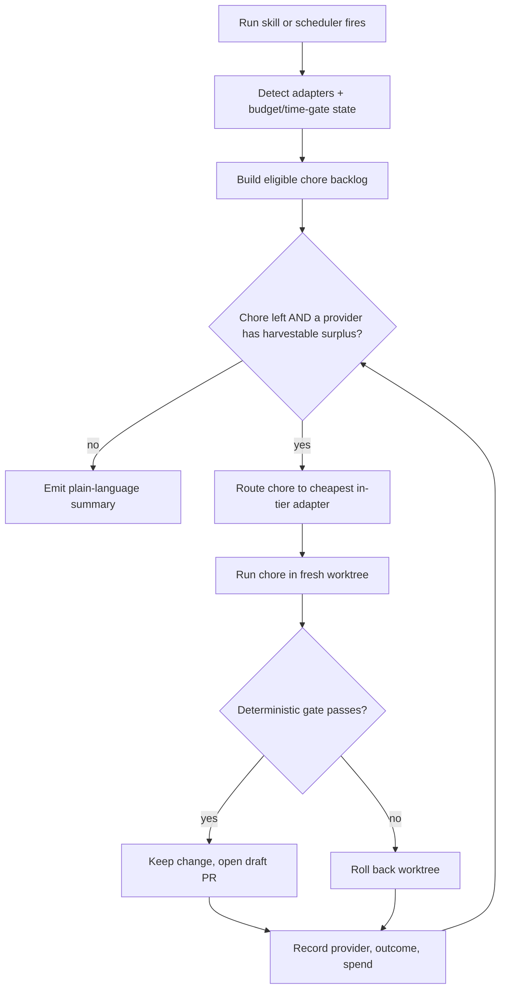

> **Historical requirements doc (superseded).** These requirements drove token-eater's
> original fleet-scheduler design. The skill has since been simplified to a meta-skill —
> you pick the service, and it spends that service on any gate-verifiable chore. The
> current behavior lives in `SKILL.md` and `references/`; treat this file as historical
> context.

# token-eater — Surplus Credit Harvester — Requirements

## Summary

token-eater is a portable Claude Code skill that finds a project's safe maintenance chores and runs them on whichever model subscription has idle, about-to-expire capacity — auto-detecting Claude, OpenAI (Codex), and Grok. Every change is isolated in a worktree, proven by a deterministic gate, and landed as a draft PR for review. It ships to House of Vibe members with zero setup and doubles as the author's on-demand harvester; the scheduled, fully-unattended power-user version layers on top later.

---

## Problem Frame

Every model subscription carries headroom that resets and expires unused — weekly Grok credits, Anthropic and OpenAI usage caps. Once the window closes, that capacity is pure waste. Separately, a backlog of low-stakes maintenance — formatting and lint debt, dead code, AI slop, stale dependencies, missing tests — accumulates in every project and rarely justifies premium attention.

House of Vibe members feel both sides at once: they hit Claude rate limits while building, and their vibe-coded projects accrue slop they cannot easily clean. Nothing today converts the first surplus into burning down the second — safely, and without a human babysitting a weaker model on each task.

---

## Actors

- A1. House of Vibe member — a non- or semi-technical builder who runs the skill on their own project, reviews a draft PR plus a plain-language summary, and assumes no extra infrastructure.
- A2. Power user (the author) — runs it on-demand today, schedules it unattended later; has supporting infrastructure (a balance oracle, auth profiles, systemd).
- A3. Orchestrator — Claude Code. Plans, selects provider and chore, runs the gate, and manages git. Never delegates these.
- A4. Provider adapter — a thin descriptor per model CLI (claude, codex, grok in v1) declaring how it is invoked headlessly, its reset cadence, its budget signal, its strength tier, and its circuit-breaker signal.

---

## Key Decisions

- One portable skill as the shared core. Members and power users run the same artifact; power-user infrastructure (the scheduler, a real-balance oracle) layers on top rather than forking a second product.
- A balance signal is optional, not a dependency. A provider's remaining-budget signal may be "none" — Grok exposes no headless balance anywhere, and the local oracle (onwatch) covers only Anthropic and OpenAI. The loop is built to run correctly without one and uses a real signal only where it exists; the signal field stays in the adapter interface so a provider that later exposes usage integrates with no loop change.
- Harvest posture per provider: drain or protect. A drain provider is pure surplus that expires (Grok, a member's cheap secondary) — the goal is to exhaust it, so it runs until it signals credit exhaustion or the backlog empties, with no balance check, no reserve floor, and no time window. A protect provider is capacity the user needs (Anthropic, OpenAI, or a member's only provider) — harvested only as spare, inside an idle window, never while actively in use, and never below a reserve floor.
- Deterministic-gate eligibility. A chore is delegable only if its correctness is provable by a machine gate — tests, type check, lint, formatter idempotency, or build. This is the trust model for a weaker model running unattended.
- Isolation and draft PR, never auto-merge. Every run executes in a fresh worktree and lands as a draft PR.
- Auto-detect adapters; v1 ships claude, codex, and grok. The cheapest idle adapter whose strength covers the chore wins.
- Ship as a `disable-model-invocation` beta mirroring the existing delegation beta.

---

## Requirements

**Provider adapters**

- R1. The skill auto-detects which supported model CLIs are installed (claude, codex, grok in v1) and treats each as an available adapter.
- R2. Each adapter declares five things: its headless-invoke command, its reset cadence, its remaining-budget signal (or "none"), its strength tier, and its rate-limit / circuit-breaker signal.
- R3. Adding a provider is a configuration entry, not a change to the core loop.
- R4. When no supported adapter is installed, the skill exits with a plain-language explanation and changes nothing.

**Eligibility and routing**

- R5. A chore is eligible only if its correctness is verifiable by a deterministic gate (tests, type check, lint, formatter idempotency, or build).
- R6. Each eligible chore routes to the cheapest available adapter whose strength tier covers the chore's tier; a stronger, more expensive adapter is used only when its surplus would otherwise expire.

**Credit and budget control**

- R7. Each provider is assigned a harvest posture — drain (exhaust pure surplus that expires) or protect (preserve capacity the user needs). A provider whose credits do not expire is never assigned drain.
- R8. A drain-posture provider is harvested until it signals credit exhaustion (rate-limit or refusal) or the backlog empties; it requires no balance signal, no reserve floor, and no time window.
- R9. A protect-posture provider is harvested only as spare capacity: within an idle window, never while the user is actively using it, and never below a reserve floor.
- R10. The remaining-budget signal is optional. Where a balance oracle exists for a protect-posture provider, the loop uses it to hold the reserve floor; absent one, the provider is harvested conservatively (idle window only) or not at all.
- R11. The adapter's balance-signal field stays in the interface even when it reports "none," so a provider that later exposes usage data integrates without loop changes.

**Execution and safety**

- R12. Every delegated chore runs in a fresh git worktree, isolated from the working tree and the default branch.
- R13. After delegation, the orchestrator runs the chore's deterministic gate and keeps only gate-passing changes.
- R14. Gate-passing results land as a draft PR or branch; nothing auto-merges to the default branch.
- R15. A failing or malformed delegation is rolled back within its worktree and leaves the working tree untouched.
- R16. The loop stops a provider after a fixed number of consecutive failures and continues with the others.
- R17. Each run records, per chore, the provider used, the gate outcome, the spend, and the PR or branch reference.

**Member experience**

- R18. The skill runs with zero setup beyond installation — no oracle, auth-profile manager, scheduler, or curated backlog required.
- R19. For members, the chore backlog is auto-discovered from the project (formatting and lint debt, dead code, AI slop, inferable missing tests); members do not curate a list.
- R20. Results are summarized in plain, non-technical language alongside the draft PR.
- R21. The conservative member default (R8 idle window, R9 active-use guard, R6 prefer-cheap-secondary) is on by default and can be loosened by a power user.

---

## Key Flow

- F1. Harvest run
  - **Trigger:** the user runs the skill, or a scheduler invokes it headlessly.
  - **Actors:** A1 or A2, A3, A4.
  - **Steps:** detect adapters and their budget / time-gate state; build the eligible chore backlog (auto-discovered for members); pick the next chore; route it to the cheapest in-tier adapter with harvestable surplus; run it in a worktree; run the deterministic gate; on pass keep the change and open a draft PR, on fail roll the worktree back; record outcome and spend; repeat until every provider reaches its reserve floor or its window closes, or the backlog empties; emit a plain-language summary.
  - **Covered by:** R1, R5, R6, R7, R8, R12, R13, R14, R17, R20.

---

## Acceptance Examples

- AE1. **Covers R9.** Given a member whose only provider is Claude (protect posture) and who is actively in a Claude Code session, when the skill runs, then it harvests nothing and reports there is no spare capacity right now.
- AE2. **Covers R6.** Given an eligible formatting chore while both Grok and Claude have surplus, when routing, then the chore runs on Grok as the cheapest in-tier adapter.
- AE3. **Covers R7, R8.** Given Grok in drain posture with a full backlog, when the loop runs, then it keeps delegating to Grok — without checking any balance — until Grok signals credit exhaustion or the backlog empties.
- AE4. **Covers R13, R14, R15.** Given a delegated chore whose changes fail the gate, when the gate runs, then the worktree is rolled back, no PR is opened, and the working tree is untouched.
- AE5. **Covers R10.** Given a power user whose oracle covers Anthropic (a protect provider), when deciding whether to keep harvesting it, then the loop uses the oracle's real remaining percentage to hold the reserve floor.

---

## Success Criteria

- A member with a vibe-coded project can run the skill once, with no configuration, and get a reviewable draft PR of safe cleanups plus a plain-language summary.
- The harvester never takes a provider below its reserve floor and never blocks the user's interactive work.
- Every kept change passed a deterministic gate; there are zero auto-merges to the default branch.
- Adding a fourth provider requires only an adapter configuration entry, with no change to the core loop.

---

## Scope Boundaries

**Deferred for later**

- Scheduled-headless, fully-unattended runs (the power-user phase 2).
- Real-balance oracle integration for primary providers.
- Additional adapters (cursor-agent, gemini) and cross-repo / portfolio sweeps.
- A curated or issue-tracker-backed backlog as the default; auto-discovery ships first.

**Outside this product's identity**

- Auto-merging changes to the default branch — never.
- Delegating chores whose correctness cannot be machine-verified — speculative refactors, architectural changes, security-sensitive logic.
- Requiring members to buy or bundle a paid model subscription.

---

## Dependencies / Assumptions

- At least one supported model CLI (claude, codex, or grok) is installed and authenticated. Verified this session: all five candidate CLIs (claude, codex, grok, gemini, cursor-agent) are present on the author's machine.
- The target project has a runnable deterministic gate (tests, type check, lint, or build) for any chore that is not trivially verifiable; formatter-idempotent chores need only the formatter.
- Per-CLI headless invocation contracts are stable and structured-output-capable; each is preflighted before its adapter is wired. Verified: `grok` exposes `-p`, `--output-format json`, `--json-schema`, `--effort`, `--best-of-n`, and `--check`; `grok` has no headless credit-balance subcommand.
- Verified this session: the local oracle (onwatch) reports real utilization and reset timestamps for Anthropic and OpenAI/Codex only — it has no Grok/xAI coverage. Grok exposes no programmatic balance anywhere (CLI, local logs, or onwatch); its rate-limit data lives only behind the xAI web console. Grok therefore runs drain posture with no balance signal — by design, not as a gap to close.
- The existing Codex delegation harness is the structural template (result schema, background launch with separate polling, consecutive-failure circuit breaker, scope-limited rollback).
- Assumption: members' most common providers are Claude and OpenAI, then Grok (user-stated).
- Assumption: a periodic reset makes unused capacity genuinely expire for harvested providers; providers without expiry are excluded by R11.

---

## Outstanding Questions

**Deferred to planning**

- The default idle-window value for protect-posture providers (e.g., overnight) and how a member adjusts it.
- The precise definition of "actively using" a provider for R9 — default: a running interactive CLI session of that provider plus a short recent-activity window.
- Exact per-adapter headless flags and result-schema mapping.
- How auto-discovered chores are tiered and matched to gates per language and stack.
- Distribution of token-eater to House of Vibe members (member vault vs. plugin marketplace) — a go-to-market decision, not a planning blocker.

---

## Sources / Research

- Origin: the surplus-credit-harvester ideation artifact produced this session (`ce-ideate`), saved at `C:\Users\Public\grok-cli-delegation-ideation.html`.
- Structural template: the Codex delegation workflow reference shipped with the `ce-work-beta` skill (result schema, background-launch-and-poll split, circuit breaker, rollback).
- Chore-tier references: the existing `ce-simplify-code` and `de-slopify` skills.
- Packaging pattern: the beta-skills framework (`disable-model-invocation` beta, mirroring `ce-work-beta`).
- Verified this session: five model CLIs installed; `grok` headless flags and the absence of a balance subcommand; a real-balance oracle (onwatch) running locally with an open metrics endpoint and an authenticated usage endpoint.
