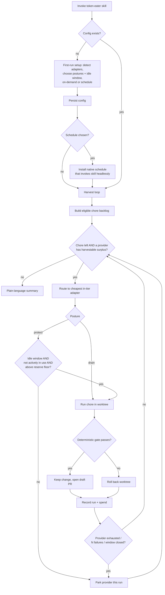
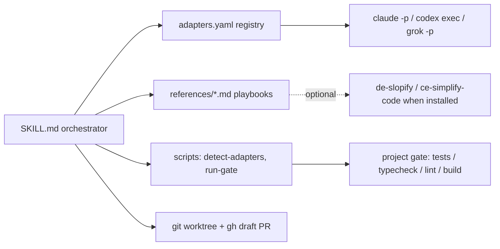

> **Historical design doc (superseded).** This plan describes token-eater's original
> fleet-scheduler architecture: drain/protect postures, capability tiers, cost-routing,
> idle windows, reserve floors, and a balance oracle. That design was deliberately
> collapsed to a much simpler meta-skill — **you pick the service, and it spends that
> service on any gate-verifiable chore.** For the current design, read `SKILL.md` and
> `references/`, not this file.

# feat: token-eater — surplus model-credit harvester skill

**Target repo:** a new greenfield `token-eater` skill package (home TBD — member vault vs. plugin marketplace is a deferred GTM call). All paths below are relative to that package root.

**Origin:** the surplus-credit-harvester requirements doc (full path: `C:\Users\Public\2026-06-26-surplus-credit-harvester-requirements.md`).

---

## Summary

Build **token-eater**, a portable, prose-orchestrated Claude Code skill that auto-detects a user's model CLIs (Claude, OpenAI/Codex, Grok), runs safe machine-verifiable chores on idle or about-to-expire capacity using a per-provider drain-vs-protect posture, and lands every change as a reviewed draft PR — never auto-merged. The skill is the single entry point: a first run sets up and persists config, later runs go straight to harvesting, and setup can install a recurring schedule for unattended runs.

---

## Problem Frame

Every model subscription carries headroom that resets and expires unused; that surplus is pure waste once the window closes. Meanwhile every project accrues low-stakes maintenance (formatting, dead code, AI slop, stale deps, missing tests) that never justifies premium attention. House of Vibe members feel both at once — they hit Claude rate limits while building, and their vibe-coded projects accrue slop. token-eater converts the first surplus into burning down the second, safely, without a human babysitting a weaker model. See origin for the full frame.

---

## Requirements

Carried from the origin doc (origin R1–R21), grouped by concern, plus one plan-introduced requirement (R22) for the setup/schedule entry model decided during planning.

**Provider adapters**
- R1. Auto-detect which supported model CLIs are installed (claude, codex, grok in v1); each becomes an available adapter.
- R2. Each adapter declares five fields: headless-invoke command, reset cadence, balance signal (or "none"), strength tier, rate-limit/circuit-breaker signal.
- R3. Adding a provider is a registry entry, not a change to the core loop.
- R4. With no supported adapter installed, the skill exits with a plain explanation and changes nothing.

**Eligibility and routing**
- R5. A chore is eligible only if its correctness is verifiable by a deterministic gate (tests, type check, lint, formatter idempotency, or build).
- R6. Each eligible chore routes to the cheapest available adapter whose strength tier covers it; a stronger, costlier adapter is used only when its surplus would otherwise expire.

**Credit control (posture)**
- R7. Each provider is assigned a harvest posture — drain (exhaust expiring surplus) or protect (preserve needed capacity). A non-expiring provider is never drain.
- R8. A drain provider is harvested until it signals credit exhaustion or the backlog empties; no balance signal, reserve floor, or time window required.
- R9. A protect provider is harvested only as spare capacity: within an idle window, never while actively in use, never below a reserve floor.
- R10. The balance signal is optional; where an oracle exists for a protect provider the loop holds the reserve floor with it, otherwise it harvests conservatively (idle window only) or not at all.
- R11. The adapter's balance-signal field stays in the contract even when it reports "none."

**Execution and safety**
- R12. Every delegated chore runs in a fresh git worktree, isolated from the working tree and default branch.
- R13. After delegation the orchestrator runs the chore's deterministic gate and keeps only gate-passing changes.
- R14. Gate-passing results land as a draft PR or branch; nothing auto-merges to the default branch.
- R15. A failing or malformed delegation is rolled back within its worktree, leaving the working tree untouched.
- R16. A provider is parked after a fixed number of consecutive failures; the loop continues with the others.
- R17. Each run records, per chore, the provider used, gate outcome, spend, and PR/branch reference.

**Member experience**
- R18. Runs with zero setup beyond installation — no oracle, auth manager, scheduler, or curated backlog required.
- R19. For members, the chore backlog is auto-discovered; members do not curate a list.
- R20. Results are summarized in plain, non-technical language alongside the draft PR.
- R21. The conservative protect default (idle window, never-while-active) is on by default and can be loosened.

**Setup and scheduling (plan-introduced)**
- R22. A first run sets up and persists config (detected adapters, postures, idle window, on-demand vs. schedule); later runs load it and skip setup. Setup can install a platform-native recurring schedule that invokes the skill headlessly.

---

## Key Technical Decisions

- KTD1. Prose-orchestrated skill, not a code library. Mirror `ce-work-beta`: a `SKILL.md` plus `references/` that Claude drives, bash for CLI invocations, helper scripts only where logic is genuinely scriptable (adapter detection, gate classification). Keeps the artifact portable and member-installable.
- KTD2. Clone the Codex delegation harness per adapter. Reuse the 5-field result schema, background-launch + separate-poll split, structured-output enforcement, scope-limited rollback, and platform/recursion guards from `ce-work-beta`'s `codex-delegation-workflow.md` rather than reinventing them (origin R12–R16).
- KTD3. Drain-vs-protect posture is the core control abstraction (origin R7–R11). Drain runs to exhaustion blind; protect runs idle-window + never-while-active, with a reserve floor only when an oracle exists.
- KTD4. The balance signal is an optional adapter field; "none" is fully supported. v1 protect providers harvest blind; the onwatch oracle is deferred. The field stays in the contract so a future signal integrates without loop changes (origin R11).
- KTD5. First-run setup persists config; later runs load it and skip setup (R22). Config is a simple user- and/or project-scoped file the skill reads and writes.
- KTD6. Bundle a minimal self-contained safe-chore set; hand off to `de-slopify` / `ce-simplify-code` only when they are installed. Keeps the skill zero-dependency for House of Vibe members.
- KTD7. Schedule installation detects the platform and installs the native scheduler (cron / launchd / systemd user timer / Windows Task Scheduler) where it can, with a copy-paste fallback snippet otherwise. The scheduled path simply invokes the skill headlessly against saved config.
- KTD8. Ship as a `disable-model-invocation` beta mirroring `ce-work-beta` — manual invocation only, no wiring into other skills' handoffs during the beta.
- KTD9. Deterministic-gate eligibility is the trust boundary (origin R5): a chore is delegable only if a machine gate can verify it, and nothing ever auto-merges (origin R14). This is what makes unattended delegation to a weaker model safe.

---

## High-Level Technical Design

End-to-end control flow — the skill is the single entry point; first run branches to setup, later runs load config and enter the harvest loop:



Component topology — a thin orchestrator over declarative adapters, reference playbooks, and external CLIs:



---

## Output Structure

```text
token-eater/
  SKILL.md                       # U1 — entry orchestration, arg/config resolution, beta frontmatter
  adapters.yaml                  # U2 — declarative adapter registry (add a provider = an entry here)
  references/
    adapter-contract.md          # U2 — the 5-field contract + the three v1 adapters
    setup-and-config.md          # U3 — onboarding flow + config schema
    delegation-invocation.md     # U4 — cloned Codex harness: schema, poll, rollback, preflight
    chore-discovery.md           # U5 — auto-discovery + deterministic-gate eligibility + tiering
    harvest-loop.md              # U6 — drain/protect posture engine + stop conditions
    result-handling.md           # U7 — draft PR, plain-language summary, run ledger
    schedule-install.md          # U8 — cross-platform schedule installer
  scripts/
    detect-adapters.sh           # U2 — command -v scan, posture defaults
    run-gate.sh                  # U4/U5 — run the project's deterministic gate, classify pass/fail
  README.md                      # U1 — member onboarding
```

The tree is a scope declaration, not a constraint; the per-unit Files lists are authoritative.

---

## Implementation Units

### U1. Skill scaffold and entry orchestration

- **Goal:** Create the package skeleton and the entry control flow that branches first-run setup vs. configured run.
- **Requirements:** R4, R18, R22.
- **Dependencies:** none.
- **Files:** `SKILL.md`, `README.md`.
- **Approach:** Frontmatter mirrors `ce-work-beta` (`name: token-eater`, `disable-model-invocation: true`, an `argument-hint` covering tokens like `setup`, `dry-run`, `provider:<id>`). Parse arguments, then resolve state via token > config-file > first-run setup. On entry: no config → branch to setup (U3); config present → load it and enter the harvest loop (U6); no supported adapter → clean exit (R4). README is a member-facing "what it does / how to run" page.
- **Patterns to follow:** `ce-work-beta/SKILL.md` argument parsing and settings-resolution chain.
- **Test scenarios:** Test expectation: none — prose orchestration; entry-branch behavior is exercised by the setup (U3) and loop (U6) acceptance scenarios.
- **Verification:** Skill loads; invoking with no config routes to setup, with config routes to the loop, with no adapters exits cleanly.

### U2. Provider adapter contract and registry

- **Goal:** Define the declarative adapter contract and instantiate the three v1 adapters with detection.
- **Requirements:** R1, R2, R3, R6.
- **Dependencies:** U1.
- **Files:** `adapters.yaml`, `references/adapter-contract.md`, `scripts/detect-adapters.sh`.
- **Approach:** `adapters.yaml` entries carry id, invoke template (with the structured-output flag), reset cadence, balance signal (`none` | named oracle), strength tier, circuit-breaker signal, default posture, cost rank. Seed claude (`claude -p`, protect, tier high), codex (`codex exec --output-schema`, protect, tier high), grok (`grok -p --output-format json --json-schema`, drain, balance none, tier mechanical, cheapest). `detect-adapters.sh` runs `command -v` per id and emits the installed set with default postures. The loop reads the registry generically so a fourth entry needs no loop edit (R3).
- **Patterns to follow:** `codex-delegation-workflow.md` invocation shape; pass-paths-not-content for prompt assembly.
- **Test scenarios:** `detect-adapters.sh` with only grok installed lists grok (drain); with all three lists all with default postures; with none emits the clean-exit signal (R4). `adapters.yaml` parses. Routing picks the cheapest in-tier adapter — a mechanical chore with grok and claude present selects grok (Covers AE2). Adding a synthetic fourth registry entry is picked up by routing with no loop change (R3).
- **Verification:** Detection output matches installed CLIs; routing selects by tier then cost.

### U3. First-run setup and config persistence

- **Goal:** An interactive onboarding that detects adapters, elicits harvest goals, and persists config the skill reuses.
- **Requirements:** R7, R9, R18, R21, R22.
- **Dependencies:** U2.
- **Files:** `references/setup-and-config.md`.
- **Approach:** Walk the user through: confirm detected adapters; assign posture per provider (default grok → drain, claude/codex → protect); set the idle window (default overnight) and never-while-active guard; choose on-demand or a recurring schedule. Write a config file (user-scoped, e.g. a `token-eater` config under the user config dir, with optional per-project override) holding providers, postures, idle window, reserve-floor defaults, and schedule choice. Later runs load it and skip setup. Conservative protect defaults are on unless the user loosens them (R21).
- **Patterns to follow:** the platform blocking-question tool for one-question-at-a-time onboarding; `ce-work-beta` config-write merge behavior.
- **Test scenarios:** Config round-trip — written postures, idle window, and schedule choice read back identically on the next run. A run with existing config skips setup. Choosing "on-demand" persists no schedule; choosing "schedule" flags U8. Default posture assignment matches provider (grok → drain, claude/codex → protect).
- **Verification:** Second invocation skips onboarding and uses saved values.

### U4. Per-adapter headless delegation harness

- **Goal:** Clone the Codex delegation harness to run one chore on one adapter, isolated and verified.
- **Requirements:** R12, R13, R15, R16.
- **Dependencies:** U2.
- **Files:** `references/delegation-invocation.md`, `scripts/run-gate.sh`.
- **Approach:** Per chore — create a fresh worktree; assemble a scope-fenced prompt (task, explicit file list, success criterion, safety constraints from chore eligibility); invoke the adapter headlessly with structured output constrained to the 5-field result schema (`status`, `files_modified`, `issues`, `summary`, `verification_summary`); use background-launch + a separate polling call to avoid the 2-minute timeout; on result, `run-gate.sh` runs the project's deterministic gate; keep on green, roll the worktree back on red or malformed result; guard against delegating inside a sandbox (recursion/platform guard). A one-time headless-contract preflight validates each adapter (stdin closed, JSON on error paths, non-zero exit on failure) before first use.
- **Execution note:** Start with the headless-contract preflight as a failing check, then wire the invocation against it.
- **Patterns to follow:** `ce-work-beta/references/codex-delegation-workflow.md` (direct template — schema, poll split, rollback, classification table).
- **Test scenarios:** Covers AE4 — a chore whose changes fail the gate rolls back the worktree, opens no PR, leaves the working tree untouched. Exit code 0 with absent/malformed result → task failure + rollback. Exit code ≠ 0 → CLI failure parks the provider (R16). A well-formed run produces a parseable 5-field result. The preflight fails fast on an adapter that hangs on closed stdin.
- **Verification:** Gate-pass keeps the diff in the worktree; gate-fail and CLI-fail both leave the working tree clean.

### U5. Chore discovery and deterministic-gate eligibility

- **Goal:** Auto-discover safe chores for a project and admit only deterministically-verifiable ones.
- **Requirements:** R5, R6, R19, R20.
- **Dependencies:** U1.
- **Files:** `references/chore-discovery.md`.
- **Approach:** Discover candidate chores from cheap signals (formatter/lint debt, dead code, AI slop, inferable missing tests). Admit a chore only if a deterministic gate exists for it (tests, type check, lint, formatter idempotency, or build), and tag it with that gate plus a tier (mechanical vs. higher). Bundle a minimal self-contained chore set (prompts + the gate each needs); when `de-slopify` or `ce-simplify-code` are installed, route the matching tier to them, otherwise use the bundled prompt. The member path is fully automatic — no curation (R19).
- **Patterns to follow:** `de-slopify` and `ce-simplify-code` safety constraints ("never simplify away a safety check"), embedded into the chore's prompt constraints.
- **Test scenarios:** A project with a formatter admits a formatting chore gated by run-twice-idempotency. A candidate chore with no available gate is excluded (R5). With `de-slopify` installed, the deslop tier routes to it; absent, the bundled deslop prompt is used. A project with tests admits a test-backfill chore gated by the suite.
- **Verification:** Only gate-backed chores enter the backlog; tiering and routing match installed tooling.

### U6. Harvest-loop orchestration and posture engine

- **Goal:** The end-to-end loop with drain/protect posture decisions and stop conditions.
- **Requirements:** R6, R7, R8, R9, R10, R11, R16.
- **Dependencies:** U2, U3, U4, U5.
- **Files:** `references/harvest-loop.md`.
- **Approach:** Detect adapters and their state → build the eligible backlog (U5) → pick the next chore → route to the cheapest in-tier adapter with harvestable surplus → delegate (U4) → gate → record (U7) → repeat. Posture branch: a drain provider runs with no balance/floor/window until it signals exhaustion or the backlog empties (R8); a protect provider runs only inside the idle window, never while actively in use, and above a reserve floor when an oracle is present — otherwise conservatively or skipped (R9, R10). The circuit breaker parks a provider after N consecutive failures and continues with the rest (R16).
- **Patterns to follow:** origin Key Flow F1.
- **Test scenarios:** Covers AE1 — a protect provider that is the user's only adapter and is actively in session harvests nothing and reports no spare capacity. Covers AE3 — a drain-posture grok with a full backlog keeps delegating, without any balance check, until it signals exhaustion or the backlog empties. Routing prefers the cheapest in-tier adapter (Covers AE2). A provider parks after N consecutive failures while others keep running.
- **Verification:** Each posture's stop condition fires correctly; no protect provider is touched while active.

### U7. Result handling: draft PR, plain-language summary, run ledger

- **Goal:** Land gate-passing changes as a draft PR, summarize for members, and record each run.
- **Requirements:** R14, R17, R20.
- **Dependencies:** U4, U6.
- **Files:** `references/result-handling.md`.
- **Approach:** A gate-passing worktree becomes a branch plus a draft PR (`gh pr create --draft`), or a branch-only result when there is no remote; nothing merges to the default branch (R14). Each chore appends a ledger entry — provider, gate outcome, spend estimate, PR/branch reference (R17). The run ends with a plain-language member summary of what was cleaned and what to review (R20).
- **Test scenarios:** A gate-pass opens a draft PR and leaves the default branch untouched. A no-remote project falls back to a branch only. A ledger row is written per chore with all four fields. The member summary lists chores in non-technical language.
- **Verification:** Draft PR exists, default branch unchanged; ledger and summary reflect every chore run.

### U8. Optional schedule installation

- **Goal:** When the user opts into recurring runs, install a platform-native schedule that invokes the skill headlessly.
- **Requirements:** R22.
- **Dependencies:** U3.
- **Files:** `references/schedule-install.md`.
- **Approach:** Detect the platform, then generate and install the native scheduler entry — cron or systemd user timer on Linux, launchd plist on macOS, Task Scheduler on Windows — that runs the skill headlessly (`claude -p "/token-eater"`) in the chosen window against saved config. For unsupported or locked-down environments, emit a copy-paste snippet and instructions instead of silently failing. Provide an uninstall path that removes the schedule.
- **Test scenarios:** On Linux a cron/systemd entry is generated with the correct command and window. On macOS a launchd plist is generated. On an unknown platform a fallback snippet is emitted rather than an error. The uninstall path removes the installed schedule. The scheduled invocation runs against saved config without prompting.
- **Verification:** The installed schedule fires the skill headlessly in the configured window; uninstall cleanly removes it.

---

## Scope Boundaries

**Deferred for later** (from origin)
- The onwatch reserve-floor oracle — a real remaining-balance signal for protect providers (Anthropic/OpenAI). v1 protect-harvesting is blind (time-gated). The balance-signal field is stubbed so this drops in later (R11).
- Additional adapters beyond claude/codex/grok (cursor-agent, gemini).
- Cross-repo / portfolio sweeps across many projects.

Note: simple schedule *installation* moved into v1 this planning session (R22, U8); only the heavier unattended infrastructure beyond a basic timer (oracle-backed reserve floors, account rotation) stays deferred.

**Outside this product's identity** (from origin)
- Auto-merging changes to the default branch — never.
- Delegating chores whose correctness cannot be machine-verified (speculative refactors, architecture, security-sensitive logic).
- Requiring members to buy or bundle a paid model subscription.

**Deferred to Follow-Up Work** (plan-local)
- An onwatch `/metrics` reader module that maps `provider`, `quota_utilization_percent`, and `quota_reset_timestamp_seconds` into protect-provider reserve floors.
- Spend-estimation refinement per provider (self-metering from each run's reported token usage as a soft cap).
- Richer chore tiers beyond the bundled starter set.

---

## Acceptance Examples

- AE1. **Covers R9 (U6).** A member whose only provider is Claude (protect) and who is actively in a Claude Code session: the skill harvests nothing and reports no spare capacity.
- AE2. **Covers R6 (U2, U6).** A formatting chore with both grok and claude available: routed to grok as the cheapest in-tier adapter.
- AE3. **Covers R7, R8 (U6).** grok in drain posture with a full backlog: keeps delegating, without checking any balance, until grok signals exhaustion or the backlog empties.
- AE4. **Covers R13, R14, R15 (U4, U7).** A delegated chore that fails the gate: worktree rolled back, no PR opened, working tree untouched.
- AE5. **Covers R10 — exercised once the onwatch oracle ships (deferred).** A power user whose oracle covers Anthropic (protect): the loop holds the reserve floor using the oracle's real remaining percentage rather than harvesting blind.

---

## Risks & Dependencies

- Per-CLI headless contract variance — each adapter's headless flags, structured-output behavior, and error/exit semantics differ and must be preflighted (U4). grok flags are verified; `codex exec --output-schema` is known from the existing harness; `claude -p` structured output needs confirming during U4.
- Cross-platform schedule install — cron / launchd / systemd / Task Scheduler differ; v1 installs the native scheduler where detected and falls back to a copy-paste snippet otherwise (KTD7, U8).
- Gate availability per project — eligibility shrinks when a project lacks tests, types, or lint; members' vibe-coded projects may have thin gates, so formatter-idempotent chores are the safe floor (U5).
- Blind protect harvesting — without an oracle, protect safety rests on time-gating and the never-while-active guard; the definition of "actively using" defaults to a running interactive session of that provider plus a short recent-activity window (origin deferred this to planning).
- Beta isolation — `disable-model-invocation`, manual invocation only; do not wire token-eater into other skills' handoffs during the beta (KTD8).

---

## Sources / Research

- `ce-work-beta/references/codex-delegation-workflow.md` — the delegation harness template: 5-field result schema, background-launch + poll split, scope-limited rollback, result classification table.
- `ce-work-beta/SKILL.md` — frontmatter, argument parsing, settings-resolution chain, and the `disable-model-invocation` beta pattern.
- `de-slopify` and `ce-simplify-code` SKILL.md — chore-tier executors and their behavior-preservation safety constraints.
- Verified this session: `grok` headless flags (`-p`, `--output-format json`, `--json-schema`, `--effort`, `--best-of-n`, `--check`) and the absence of a balance subcommand; `claude`, `codex`, `grok`, `gemini`, `cursor-agent` all installed.
- onwatch `/metrics` (deferred oracle) — exposes `onwatch_quota_utilization_percent` and `onwatch_quota_reset_timestamp_seconds` for `provider="anthropic"` and `provider="codex"` only; no Grok/xAI coverage.
- Origin requirements doc (full path in the header) — problem frame, R1–R21, AE1–AE5, posture model, scope boundaries.
